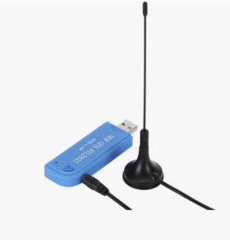

# FM Radio

A command-line FM radio application using RTL-SDR, built with Python and Textual.




## Features

- Real-time FM radio reception using RTL-SDR
- Text-based user interface
- Frequency tuning with validation
- Live audio streaming
- Status updates and error handling

## Requirements

- Python 3.8 or higher
- RTL-SDR dongle
- System dependencies:
  - librtlsdr (for RTL-SDR support)
  - PortAudio (for audio output)

### Installing System Dependencies

#### macOS
```bash
brew install librtlsdr portaudio
```

#### Ubuntu/Debian
```bash
sudo apt-get install librtlsdr-dev portaudio19-dev
```

## Installation

1. Clone the repository:
```bash
git clone https://github.com/yourusername/fmradio.git
cd fmradio
```

2. Create and activate a virtual environment (optional but recommended):
```bash
python -m venv .venv
source .venv/bin/activate  # On Windows: .venv\Scripts\activate
```

3. Install the package:
```bash
pip install -e .
```

## Usage

Run the application:
```bash
fmradio
```

### Controls

- Enter a frequency (in MHz) and click "Tune / Play" or press Enter
- Click "Stop Stream" to stop playback
- Press 'q' to quit the application

### Valid Frequency Ranges

- Standard FM band: 87.5 - 108.0 MHz
- Japanese FM band: 76.0 - 95.0 MHz
- OIRT FM band: 65.0 - 74.0 MHz

## Development

To set up the development environment:

1. Install development dependencies:
```bash
pip install -e ".[dev]"
```

2. Run tests:
```bash
pytest
```

## License

This project is licensed under the MIT License - see the LICENSE file for details. 